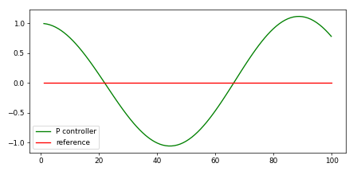
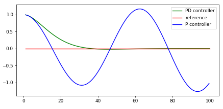
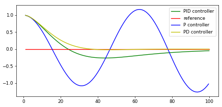

# CarND-Controls-PID
Self-Driving Car Engineer Nanodegree Program

---

## PID Controller

**PID** -> proportional–integral–derivative controller

PID controller is to read the CTE "Cross Track Error", then compute the desired steering output by calculating proportional, integral, and derivative responses and summing those three components to compute the output.

**P - Controller :**
  Gives steering output which is proportional to current error **"CTE"** by multiplying the error by the gain factor **"kp"**

  Example for the effect of P - Controller

  

  ** D - Controller : **
    Derivative which is the rate of change of the error **"CTE"** is calculated with respect to time, multiplied by another constant **"kd"**, and added to the output of the P-Controller.

  Example for the effect of PD - Controller

  

  ** I - Controller : **
    The error **"CTE"** is integrated (averaged) over a period of time, and then multiplied by a constant **"Ki"** ,and added to PD-Controller output.

  Example for the effect of PID-Controller :

  

  Parameters in this project is tuned manually.

  
